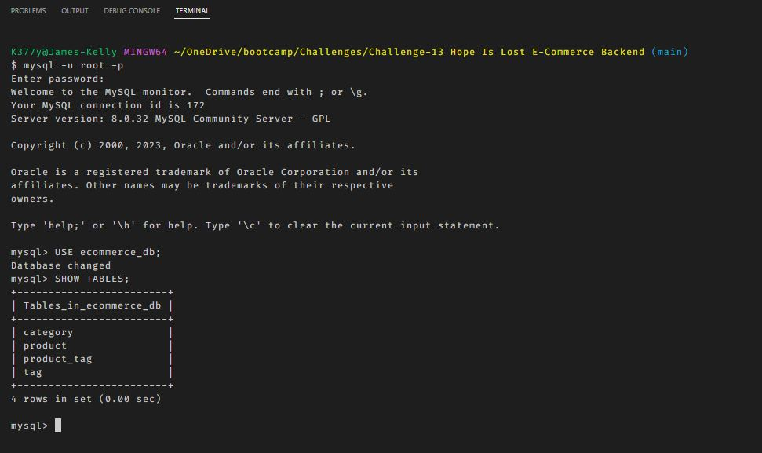
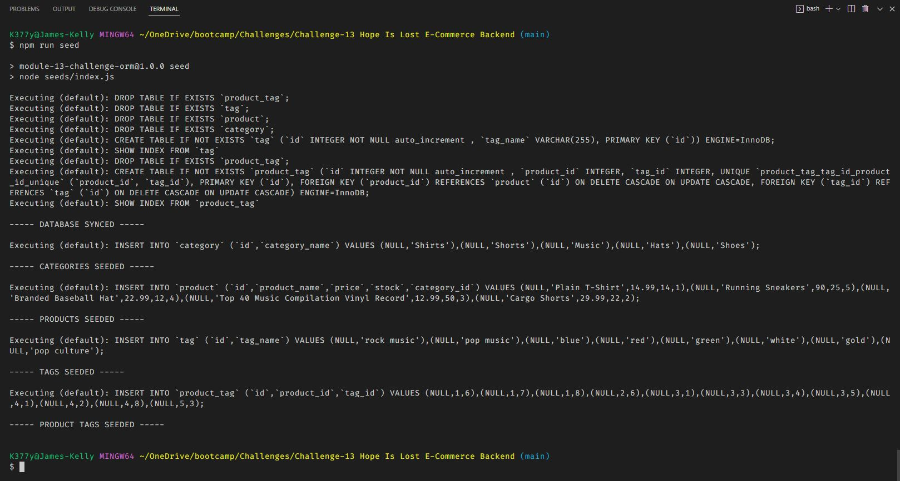
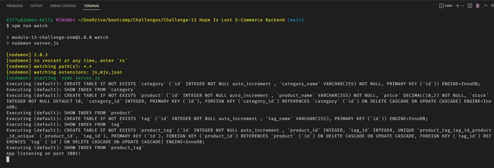
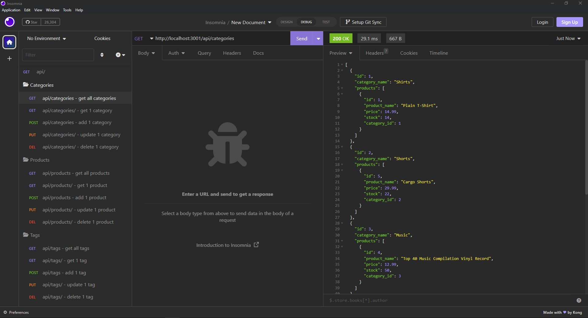
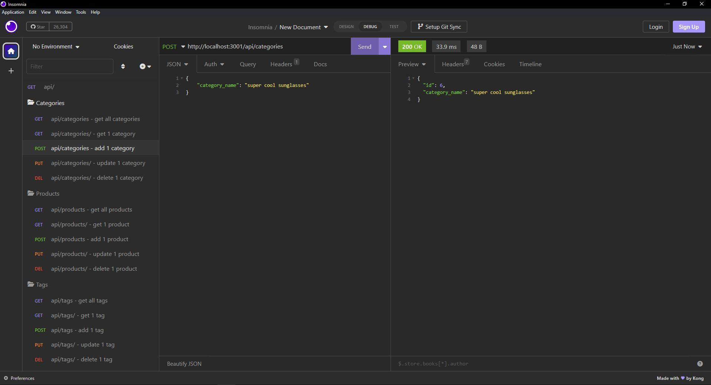
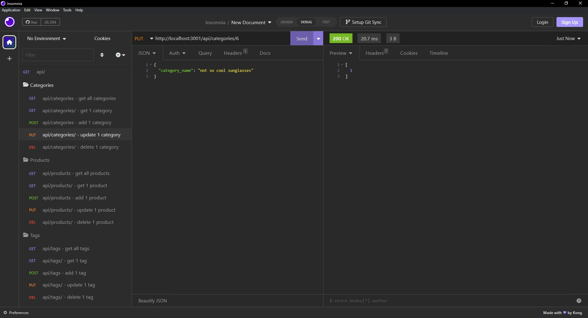
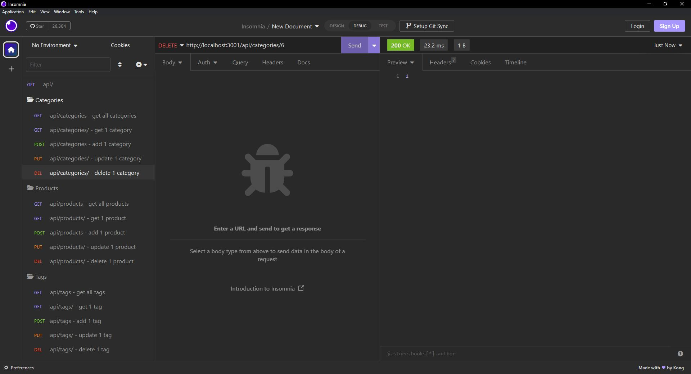

# ***hope-is-lost-ecommerce-backend***

 
Your challenge is to build the back end for an e-commerce site. You’ll take a working Express.js API and configure it to use Sequelize to interact with a MySQL database.
 

## **Description**
The objective of this challenge is to create a functioning database that can be interacted with using the GET, POST, PUT and DELETE routes. We start with some starter code but must complete the code to make it fully functional.  Once the code is completed, we are able to successfully create, update and delete data from our ecommerce database.
 

## Table of Contents
- [Installation](#installation)
- [Usage](#usage)
- [Questions](#questions)
- [Contributing](#contributing)
- [License](#license)
 

## Installation
You must have node.js installed on your system. 
You can run [npm install] to install all the required npm packages. 
The packages that will be imported are:
     &emsp;1) MYSQL2
     &emsp;2) EXPRESS
     &emsp;3) SEQUELIZE
     &emsp;4) DOTENV
     &emsp;5) NODEMON
 

## Usage

 A demo of the application can be viewed here:
 https://www.google.com
 The source code for the application can be viewed here:
 https://github.com/jk377y/hope-is-lost-ecomm-backend

 
To start the program, open the command terminal from the root directory.
 
First we need to login, access and use our database:
  

 
Next we will need to provide some initial data by seeding the database:
  

 
Then we will need to connect to our server by typing [npm run watch]:
  

  
Once connected, you will be able to access/edit the database through route commands by using Insomnia
  
The GET route will retreive data from the database.
  

  
The POST route will add data to the database.
  

  
The PUT route will allow you to change data in the database that already exists.
  

  
The DELETE route will allow you to delete data from the database.
  

  

## Questions
For Questions, I can be reached at the following:
 GitHub:  https://github.com/jk377y
 OR
 Email:  jk377y@gmail.com
 

## Contributing
FABIEN MORENO @ https://www.linkedin.com/in/fabien-moreno/
For collaboration, ideas and assistance.
 
WittCode @ https://www.youtube.com/@WittCode/videos for instructional videos on relavent topics.
 
MOSH HAMEDANI @ https://www.codewithmosh.com for instructional videos on relavent topics.
 
GHULAM ABBAS @ UDEMY https://www.udemy.com/course/build-restful-api-in-nodejs/ for Node.js - The Complete RESTful API Masterclass (2023)
 
BEZKODER - https://www.bezkoder.com/node-js-express-sequelize-mysql/ (for research and documentation referencing)
 
NPM - https://www.npmjs.com/ (for research and documentation referencing)
 
MYSQL2 NPM package - https://www.npmjs.com/package/mysql2 (for research and documentation referencing)
 
SEQUELIZE NPM package - https://sequelize.org/  and https://www.npmjs.com/package/sequelize (for research and documentation referencing)
 
DOTENV NPM package - https://www.npmjs.com/package/dotenv (for research and documentation referencing)
 
You also can help support me by donating with 💵Cash App💵 @ 💵$JK377Y💵
 

## License

 Copyright (c) 2023 James Kelly
 Information on this license can be found at: (https://opensource.org/licenses/MIT)